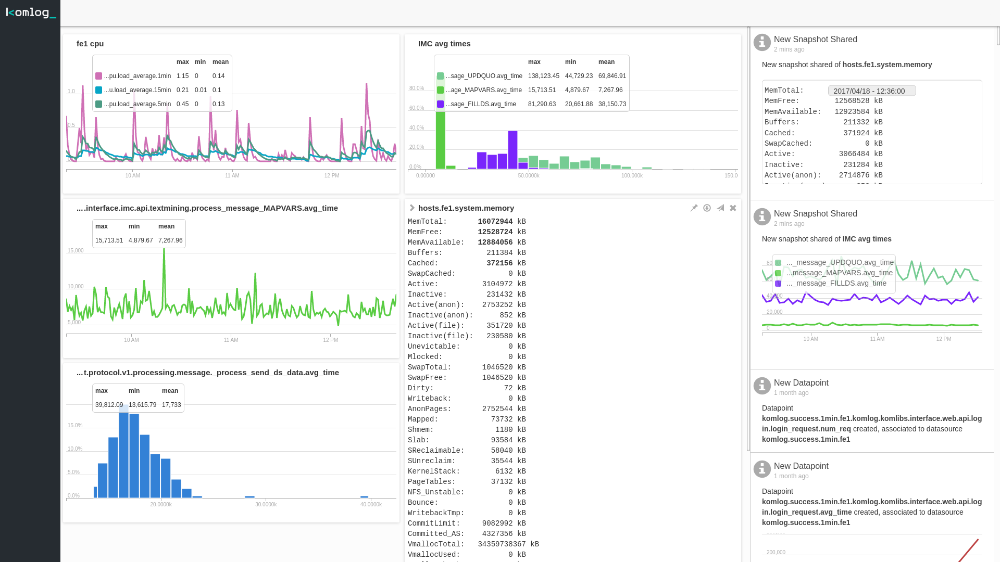
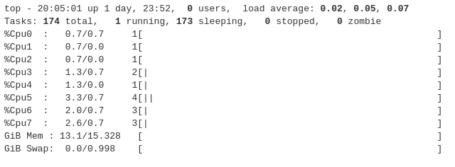

[](https://gitter.im/komlog_/komlog?utm_source=badge&utm_medium=badge&utm_campaign=pr-badge&utm_content=badge)
[]()

> This repository is for komlogd, the Komlog agent.

[Komlog](https://www.komlog.io) is a PaaS for helping observability teams to better understand their systems.
It is a flexible and powerful platform that adapts to users needs, not vice versa, for visualizing
and processing data. It helps users in repetitive and tedious tasks, such as data cleanup,
processing and exploration.




Komlog is designed with a key goal in mind: **machines should be able to understand and
process texts the same way people do**. Particularly, it is focused on identifying
metrics on any text, either generated with an operating system command, script or
any command line interface application.

> komlogd is not recommended for production yet (but we use it! :), however, system analysis does not begin
> in production environments, so don't let that stop you from trying it and learning.

## Komlog Primer

Suppose we type this command to see CPU utilization:

```
top -b -n 2 | awk 'BEGIN {RS=""} FNR == 3 {print}'
```

The output should be something similar to this:

```
top - 20:05:01 up 1 day, 23:52,  0 users,  load average: 0.02, 0.05, 0.07
Tasks: 174 total,   1 running, 173 sleeping,   0 stopped,   0 zombie
%Cpu0  :   0.7/0.7     1[                                                     ]
%Cpu1  :   0.7/0.0     1[                                                     ]
%Cpu2  :   0.7/0.0     1[                                                     ]
%Cpu3  :   1.3/0.7     2[|                                                    ]
%Cpu4  :   1.3/0.0     1[|                                                    ]
%Cpu5  :   3.3/0.7     4[||                                                   ]
%Cpu6  :   2.0/0.7     3[|                                                    ]
%Cpu7  :   2.6/0.7     3[|                                                    ]
GiB Mem : 13.1/15.328   [                                                     ]
GiB Swap:  0.0/0.998    [                                                     ]
```


This information should be enough for a machine to identify CPU load, users logged in or current tasks the same
way is enough for an experienced system analyst. Our goal is to solve this problem and offer a **useful platform
for a field as wide and heterogeneous as system analysis**.

Let's send the previous data to Komlog, redirecting it to its agent, komlogd, this way:

```
top -b -n 2 | awk 'BEGIN {RS=""} FNR == 3 {print}' | komlogd -u tmp.cpu
```

Komlog will show us the information this way:



As you can see, some values are in bold, meaning that Komlog has identified the value and has associated it to
the corresponding metric. Every time we send samples to Komlog, new values will be appended to metrics already detected.

> The parameter *-u* tells Komlog the *uri* to associate the data to. (the *uri* is like
> the *path* in a filesystem. In Komlog, each user stores her data in a *"filesystem"* shared between her agents.
> These and other concepts are explained in detail in the [documentation](docs/))

Internally, Komlog is an event based execution platform. This means **you can subscribe your agents to the uris
you want, and execute functions every time they are updated**. With this functionality, you can create real-time
applications for data analysis, anomaly detection, forecasting or anything related with time series analysis.

Komlog also offers a plugins subsystem which you can use to create your own plugins (we call it packages),
or use the ones shared by others. **Create a package for monitoring your favourite database, your business processes
or anything in between.**  As an example, you can check out our official package
for monitoring [Linux servers](https://github.com/komlog-io/kpack_linux).

In the next sections we'll explain in detail how to install, configure and use komlogd and the Komlog platform.

* [Installation and configuration](docs/install.md)
* [Sending data from the command line](docs/cli.md)
* [Adding third party packages](docs/adding_packages.md)
* [System architecture](docs/architecture.md)
* [Design principles](docs/design.md)
* [Creating packages](docs/creating_packages.md)


## Contributing

Feel free to fork and make your pull requests. **Thanks for taking the time to contribute to the project.**

## License

komlogd is distributed under the Apache License, Version 2.0.
