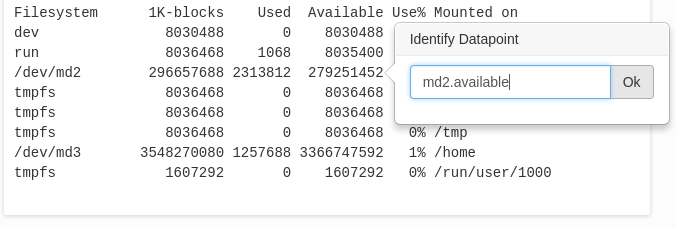

# Sending data from the command line

komlogd can send plain texts to Komlog, freeing the user of tedious tasks such as data clean up or
data parsing, allowing them visualize any metric showed in a command line interface.

You can visualize metrics in commands or scripts outputs, file contents, or anything we can show with a CLI tool.

> You can send numeric values too, not only texts, if you need it.
> Check out [design principles](design.md) for more information and advanced uses.

In this example, we are going to send the *df -k* command's output to Komlog, so we can monitor
disk occupation. In Komlog, users organize their data in a tree like structure called
the **data model**. Every element in the user's data model is identified by its **uri**.
In this example, we are going to identify our occupation data with the uri *host.occupation*.

To upload the data, we execute the following command:

```
df -k | komlogd -u host.occupation
```

If everything went right, we should see the data in our [Komlog home page](https://www.komlog.io/home),
associated to the uri *ĥost.occupation* in our data model.

First time Komlog receives data associated with a uri, it tries to identify metrics automatically.
If the content is familiar to him, it will show in bold the metrics identified.

Sometimes, Komlog cannot identify the metrics we need. In this situations, **we can identify them manually,
just clicking on the value and naming it**. This feedback helps Komlog learn new ways to identify metrics, so
the more we feed Komlog, the better and more metrics will identify automatically in the future.




We can nest our metrics in different levels using the dot character (.) For example, if we have uris *host.occupation*, *host.occupation.md1* and *host.occupation.md2*, Komlog will nest them this way:

```
    host
    └─ occupation
      ├─ md1
      └─ md2
```

> **Important**:
>
> Uris can be formed **only** with this characters:
>
> * Capital or lowercase letters [A-Za-z]: ASCII characters from *A* to *z*.
> * Numbers [0-9].
> * Special characters:
>     * Hyphen (-), underscore (_)
>     * Dot (.)
>
> An uri **cannot** start with dot (.)


