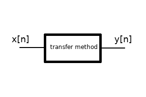

.. _api:

API
===

komlogd can be used as a library to add Komlog functionality into your applications.

.. note::

   komlogd uses `asyncio <https://docs.python.org/3/library/asyncio.html>`_ internally,
   so your application must run an asyncio loop to be able to use it.

.. warning::

   komlogd is under active development, so API can be modified.

Session initialization
----------------------

To stablish a Komlog session you need:

* Komlog user.
* RSA key.

.. note::

    komlogd creates a RSA key during its :ref:`first_execution`.

To open a session with Komlog, create a KomlogSession object with your username
and private key and call the *login* method:

.. code:: python

    import asyncio
    from komlogd.api import session, crypto

    loop = asyncio.get_event_loop()

    async def example():
        username='username'
        privkey=crypto.load_private_key('/path/to/key.priv')
        komlog_session=session.KomlogSession(username=username, privkey=privkey)
        await komlog_session.login()
        # At this point session is stablished.
        # If you need this task to wait in the loop while session is open:
        # await komlog_session.join()

        # To close the session:
        await komlog_session.close()

    try:
        loop.run_until_complete(example())
    except:
        loop.stop()
    loop.close()

komlogd stablishes a websockets connection with Komlog and internally manages reconnections.

.. important::

    You need to authorize your agent previously on Komlog web, as explained
    in :ref:`agent_authorization`.

Sending data to Komlog
----------------------

Every metric you upload to Komlog is identified with its *uri*. Based on this uri, Komlog
organize your metrics in a tree like structure. We call this structure *the user's data model*.
Every metric in your data model can take different values at different timestamps. We call each of
these values a *sample*.

You can create two types of metrics in Komlog:

* **Datasource**
* **Datapoint**

A metric is created automatically the first time you upload data to it and its type is stablished at this moment too.
You cannot modify the metric type. If you need to modify it, you have to delete the metric
and create it again with a different type.

**Datasource metrics**

A datasource is used to store texts. You can upload any text whose length is less or equal 130KB.

In this example you can see how to send a sample of a datasource metric:

.. code:: python

    import asyncio
    import pandas as pd
    from komlogd.api import session, crypto
    from komlogd.api.protocol.model.types import Datasource, Sample

    loop = asyncio.get_event_loop()

    async def send_datasource_sample():
        # connect to Komlog
        username='username'
        privkey=crypto.load_private_key('/path/to/key.priv')
        komlog_session=session.KomlogSession(username=username, privkey=privkey)
        await komlog_session.login()

        # prepare datasource sample
        uri='my_datasource'
        data='Datasource content'
        ts = pd.Timestamp('now',tz='Europe/Madrid')
        metric = Datasource(uri=uri)
        sample = Sample(metric=metric, ts=ts, data=data)

        # send sample and exit
        await komlog_session.send_samples(samples=[sample])
        await komlog_session.close()

    try:
        loop.run_until_complete(send_datasource_sample())
    except:
        loop.stop()
    finally:
        loop.close()

**Datapoint metrics**

A datapoint metric is used to store numerical values. You can use any type of numerical variables,
like *int*, *float* or `Decimal <https://docs.python.org/3/library/decimal.html>`_ (we don't
support Decimal values without numerical representation like *infinity*, *NaN*, etc).

In this fragment you can see how to send two samples associated to a pair of datapoint metrics:

.. code:: python

    import asyncio
    import pandas as pd
    from komlogd.api import session, crypto
    from komlogd.api.protocol.model.types import Datapoint, Sample

    loop = asyncio.get_event_loop()

    async def send_datapoint_samples():
        # connect to Komlog
        username='username'
        privkey=crypto.load_private_key('/path/to/key.priv')
        komlog_session=session.KomlogSession(username=username, privkey=privkey)
        await komlog_session.login()

        # prepare datapoint samples
        samples = []
        ts = pd.Timestamp('now',tz='Europe/Berlin')
        metric1 = Datapoint(uri='cpu.system')
        metric2 = Datapoint(uri='cpu.user')
        samples.append(Sample(metric=metric1, ts=ts, data=14.63))
        samples.append(Sample(metric=metric2, ts=ts, data=28.5))

        # send samples and exit
        await komlog_session.send_samples(samples=samples)
        await komlog_session.close()

    try:
        loop.run_until_complete(send_datapoint_samples())
    except:
        loop.stop()
    finally:
        loop.close()

Every metric in your *data model* is considered an independent time serie, so every sample you upload
must be associated with a timestamp. **The timestamp is set by the user, so you can upload samples
associated with a timestamp in the past or in the future.**

The timestamp can be any of these types:

* A *pandas.Timestamp* object.
* A *datetime.datetime* object.
* A ISO8601 formatted string.

**It is mandatory to include the time zone and maximum precision is milliseconds**.

.. _transfer_methods:

Transfer methods
----------------

komlogd can execute a function every time a metric is updated. We call this type of functions *transfer methods*.

The name *transfer method* is inspired by signal processing systems, where the transfer function is the relation between output and input signals.

komlogd *transfer methods* work in a similar way. The receive an input signal (time series), process it, and produce an ouput signal with the results.

By default, komlogd runs a transfer method every time the input signal changes, that is, every time the data model
metrics associated with the transfer method change.

To create transfer methods, simply add the *@transfermethod* decorator to the function.

As we saw in :ref:`configuration`, komlogd will load every *@transfermethod* decorated function
on startup if we add the file to a *transfers* block.

You can pass the following parameters to the *transfermethod* decorator:

* **p_in**: dictionary with the associated parameters and its values in our
  decorated function marked as input.
* **p_out**: dictionary with the associated parameters and its values in our
  decorated function marked as output.
* **data_reqs**: it needs a DataRequirements object. With this parameter you
  set the method data requirements per metric.
* **min_exec_delta**: min time between executions. By default, komlogd will run
  the method every time a metric is updated. With this parameter you can tell
  komlogd to run it at most once in *min_exec_delta* interval. The parameter
  must be a pandas.Timedelta object.
* **exec_on_load**: By default *False*. Tells komlogd to execute the transfer
  method as soon as its initialization has been completed.
* **allow_loops**: Bu default *False*. Tells komlogd to allow a transfer method to update
  a metric that is used as an input metric. Enabling this option is dangerous, as it may
  cause infinite loops, because when you update an input metric, the transfer method is
  executed again by default.

To show how transfer methods work, we are going to create one whose purpose is adding two input
metrics and store the result in an output one.

.. code:: python

    from komlogd.api.transfer_methods import transfermethod
    from komlogd.api.protocol.types import Datapoint

    p_in = {'x':Datapoint('my_uris.value1'),'y':Datapoint('my_uris.value2')}
    p_out = {'z':Datapoint('my_uris.total')}

    @transfermethod(p_in=p_in, p_out=p_out)
    def sum(x,y,z):
        z.data = x.data + y.data

In this example, we create the function *sum* that receives three parameters: *x*, *y*, and *z*.
Applying the @transfermethod decorator, we are telling komlogd the following:

    - **x** and **y** are input parameters.
    - **z** is an output parameter.
    - **x** parameter will receive the object *Datapoint('my_uris.value1')* on each execution.
    - **y** parameter will receive the object *Datapoint('my_uris.value2')* on each execution.
    - **z** parameter will receive the object *Datapoint('my_uris.total')* on each execution.

Declaring an **input** parameter, tells komlogd to subscribe to the associated
metric in our data model and run the function every time the metric is updated.

Declaring an **output** parameter, tells komlogd to send to Komlog every new
data found on it after each function execution.

On each execution, komlogd adds the attribute *data* to every *Datasource*
or *Datapoint* object found in the input parameters. This attribute holds a
copy of the associated metric data in the interval requested by the function.
The *data* attribute is an object of type
`pandas.Series <http://pandas.pydata.org/pandas-docs/stable/generated/pandas.Series.html>`_.
If it is an input parameter, the data attribute will have the data interval requested,
on the other hand, if it is an output parameter, the data attribute is an empty Series.

The interval requested by the function can be specified with the *data_reqs*
attribute passed to the *@transfermethod* decorator. If the decorator does not receive
it, it will add to the data attribute a Series object with the last value.

*@transfermethod* decorator can be stacked as many times as we need. For example, if we
want to apply the *sum* function to two groups of parameters, we can do it like this:

.. code:: python

    from komlogd.api.transfer_methods import transfermethod
    from komlogd.api.protocol.types import Datapoint

    p_in1 = {'x':Datapoint('my_uris1.value1'),'y':Datapoint('my_uris1.value2')}
    p_out1 = {'z':Datapoint('my_uris1.total')}

    p_in2 = {'x':Datapoint('my_uris2.value1'),'y':Datapoint('my_uris2.value2')}
    p_out2 = {'z':Datapoint('my_uris2.total')}

    @transfermethod(p_in=p_in1, p_out=p_out1)
    @transfermethod(p_in=p_in2, p_out=p_out2)
    def sum(x,y,z):
        z.data = x.data + y.data

This way, we are declaring two transfer methods, each one associated
to the metrics in their parameters. They will be run independently
every time the metrics in their input parameters are updated.

Working with remote uris
^^^^^^^^^^^^^^^^^^^^^^^^

Users can share metrics between them through Komlog in real time.

.. note::

    You can share metrics through your `Komlog configuration page <https://www.komlog.io/config>`_.
    Keep in mind that metrics **will always be shared read only and recursively**, this means that
    if you share metric *cpu.system* every nested metric in the data model tree will
    be shared too, no matter if they already existed or not when the metric was
    shared.

    Sharing metrics read only means a *transfer method* cannot modify any remote metric, so
    if they try the operation will be ignored. **Users can only modify their own data model.**

With this functionality you can create applications based on distributed data models. The way to
tell komlogd you want to subscribe to a remote uri is prepending the username to the local uri name::

    remote_uri = 'user:uri'

For example, if user *production* is sharing metrics *host1.cpu.user* and 
*host1.cpu.system*, we could apply our previous *sum* function this way to them:

.. code:: python

    from komlogd.api.transfer_methods import transfermethod
    from komlogd.api.protocol.types import Datapoint

    p_in = {'x':Datapoint('production:host1.cpu.system'),'y':Datapoint('production:host1.cpu.user')}
    p_out = {'z':Datapoint('production_hosts.host1.cpu.sum')}

    @transfermethod(p_in=p_in, p_out=p_out)
    def sum(x,y,z):
        z.data = x.data + y.data

Input and Output parameters
^^^^^^^^^^^^^^^^^^^^^^^^^^^

A transfer method can receive input and output parameters of any type, even user defined
ones. komlogd will try to find on them *Datasource* and *Datapoint* objects to add
the *data* attributes on each execution.

For example, in the next code we are going to adapt our *sum* function to work
with Vector objects (defined below) to sum three dimension vectors.

.. code:: python

    from komlogd.api.transfer_methods import transfermethod
    from komlogd.api.protocol.types import Datapoint

    class Vector:

        def __init__(self, base_uri):
            self.x = Datapoint('.'.join((base_uri,'x')))
            self.y = Datapoint('.'.join((base_uri,'y')))
            self.z = Datapoint('.'.join((base_uri,'z')))

    p_in = {'u':Vector('vector1'),'v':Vector('vector2')}
    p_out = {'w':Vector('vector3')}

    @transfermethod(p_in=p_in, p_out=p_out)
    def v_sum(u,v,w):
        w.x.data = u.x.data + v.x.data
        w.y.data = u.y.data + v.y.data
        w.z.data = u.z.data + v.z.data

