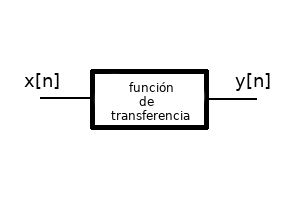

.. _api:

API
===

Komlogd puede utilizarse como librería en otras aplicaciones, y así
integrar en ellas la funcionalidad ofrecida por Komlog.

.. note::

   komlogd utiliza `asyncio <https://docs.python.org/3/library/asyncio.html>`_ internamente,
   por lo que es necesario que la aplicación donde se integre corra un loop de
   asyncio para su funcionamiento.

.. warning::

   komlogd se encuentra bajo desarrollo muy activo, por lo que la API puede cambiar.

Inicio de sesión en Komlog
--------------------------

Para establecer una sesión con komlog necesitamos:

* Un usuario de acceso.
* Una clave RSA.

.. note::

    Recuerda que komlogd durante su :ref:`primera_ejecucion` crea la clave RSA
    para la comunicación con Komlog.
    En caso de querer utilizar otra clave RSA, ésta debe ser mayor o igual a
    4096 bytes.

Para inicializar una sesión en Komlog bastaría con realizar lo siguiente:

.. code:: python

    import asyncio
    from komlogd.api import session, crypto

    loop = asyncio.get_event_loop()

    async def example():
        username='username'
        privkey=crypto.load_private_key('/path/to/key.priv')
        komlog_session=session.KomlogSession(username=username, privkey=privkey)
        await komlog_session.login()
        # En este punto la sesión estaría establecida.
        # Si necesitamos que nuestra tarea espere mientras
        # la sesión está establecida:
        # await komlog_session.join()

        # Para cerrar la sesión:
        await komlog_session.close()

    try:
        loop.run_until_complete(example())
    except:
        loop.stop()
    loop.close()

Los pasos son:

* Establecemos el usuario de la sesión.
* Cargamos la clave privada del agente, llamando a la función *crypto.load_private_key()*
  pasándole como parámetro la ruta del archivo que la contiene.
* Inicializamos un objeto *KomlogSession*, que será el encargado de contener nuestra
  sesión con Komlog, pasándole como parámetros el usuario y la clave privada.
* Llamamos al método *login()*. Este método crea una tarea en el loop de asyncio que será
  la encargada de realizar login en el servidor y mantener nuestra sesión con Komlog.
  Hasta que no se ejecute el loop de asyncio no se realizará login en Komlog.
* Por último arrancamos el loop de asyncio. En este momento se ejecutará la tarea
  de login en Komlog.

A partir de ese momento, siempre y cuando el login haya sido correcto,
tendríamos una sesión establecida con Komlog, y estaríamos
preparados para enviar y recibir información.

Internamente, komlogd establece con el servidor una conexión mediante *websockets*, por lo
que la sesión se mantiene establecida en todo momento. En caso de recibir una desconexión,
la propia librería se encarga de restablecerla.

.. important::
    Para que el login sea correcto, hay que autorizar previamente
    la clave pública de komlogd, como se explica en :ref:`autorizacion_agente`.

    La clave pública se puede obtener a partir de la clave privada, ese es el motivo
    por el cual nunca tienes que introducir la clave pública como parámetro, sino la privada,
    pero komlogd **nunca** enviará la clave privada a Komlog.

    Ante un inicio de sesión fallido porque la clave pública no ha sido autorizada, komlogd
    la muestra en los logs, para que el usuario vea cual debe autorizar.

Envío de datos a Komlog
-----------------------

En Komlog el usuario organiza sus métricas en una estructura en árbol en la que cada métrica
está identificada unívocamente por lo que llamamos *uri*. A esta estructura la llamamos *el modelo
de datos del usuario*. A los diferentes valores que puede tomar una métrica a lo
largo del tiempo se les conoce como *samples (muestras)*.

En el modelo de datos del usuario se pueden crear métricas de dos tipos:

* **Datasource**
* **Datapoint**

Komlog crea las métricas automáticamente la primera vez que subimos datos de ellas.
El tipo de una métrica se establece cuando ésta se crea, y no hay posibilidad de cambiarlo
mientras exista. Para modificar el tipo de una métrica habría que borrarla (lo que implicaría
borrar todas las muestras de datos recibidas de ella) y volverla a crearla con el tipo deseado.

**Métricas de tipo Datasource**

Una métrica de tipo Datasource se utiliza para almacenar textos. Podemos subir cualquier texto
de una longitud máxima de 130KB.

Para enviar a Komlog una muestra de un Datasource se podría hacer de la siguiente manera:

.. code:: python

    import asyncio
    import pandas as pd
    from komlogd.api import session, crypto
    from komlogd.api.protocol.model.types import Datasource, Sample

    loop = asyncio.get_event_loop()

    async def send_datasource_sample():
        # establecemos la sessión
        username='username'
        privkey=crypto.load_private_key('/path/to/key.priv')
        komlog_session=session.KomlogSession(username=username, privkey=privkey)
        await komlog_session.login()

        # preparamos el sample
        uri='my_datasource'
        data='Datasource content'
        ts = pd.Timestamp('now',tz='Europe/Madrid')
        metric = Datasource(uri=uri)
        sample = Sample(metric=metric, ts=ts, data=data)

        # enviamos sample y cerramos sessión
        await komlog_session.send_samples(samples=[sample])
        await komlog_session.close()

    try:
        loop.run_until_complete(send_datasource_sample())
    except:
        loop.stop()
    finally:
        loop.close()

**Métricas de tipo Datapoint**

Una métrica de tipo Datapoint se utiliza para almacenar valores numéricos.
Se aceptan variables de tipo int, float o `Decimal <https://docs.python.org/3/library/decimal.html>`_ (de estas últimas sólamente las que tienen representación numérica, es decir, no se aceptan valores como *infinity*, *-infinity*, *NaN*, etc).

En el siguiente ejemplo se muestra como enviar un par de muestras asociadas a dos métricas
de tipo Datapoint:

.. code:: python

    import asyncio
    import pandas as pd
    from komlogd.api import session, crypto
    from komlogd.api.protocol.model.types import Datapoint, Sample

    loop = asyncio.get_event_loop()

    async def send_datapoint_samples():
        # establecemos la sesión
        username='username'
        privkey=crypto.load_private_key('/path/to/key.priv')
        komlog_session=session.KomlogSession(username=username, privkey=privkey)
        await komlog_session.login()

        # preparamos samples
        samples = []
        ts = pd.Timestamp('now',tz='Europe/Berlin')
        metric1 = Datapoint(uri='cpu.system')
        metric2 = Datapoint(uri='cpu.user')
        samples.append(Sample(metric=metric1, ts=ts, data=14.63))
        samples.append(Sample(metric=metric2, ts=ts, data=28.5))

        # enviamos samples y cerramos sesión
        await komlog_session.send_samples(samples=samples)
        await komlog_session.close()

    try:
        loop.run_until_complete(send_datapoint_samples())
    except:
        loop.stop()
    finally:
        loop.close()

Komlog considera las diferentes métricas del modelo de datos del usuario como series temporales independientes, por lo que cuando subimos datos a alguna de nuestras métricas siempre hay que asociarle un *timestamp*.
**El usuario es el encargado de establecer el timestamp, por lo que
el valor del timestamp no tiene por qué coincidir con el del momento en el que se envían los datos.**

El timestamp que asociamos al contenido de una métrica puede ser de los siguientes tipos:

* tipo *pandas.Timestamp*
* tipo *datetime.datetime*
* tipo string en formato ISO8601

Hay que tener en cuenta que **es necesario incluir la zona horaria y que la
precisión máxima aceptada es de milisegundos**.

.. _funciones_de_transferencia:

Funciones de transferencia
--------------------------

komlogd puede ejecutar una función cada vez que una métrica se actualiza. A este
tipo de funciones les llamamos *funciones de transferencia*.

El nombre *función de transferencia* está inspirado en los diferentes bloques que
componen un sistema de comunicaciones. En este tipo de sistemas, cada bloque
recibe una señal de entrada, realiza una serie de operaciones
sobre ella, como puede ser el filtrado, muestreo, amplificación, etc, dando lugar a
una señal de salida. A la relación entre la señal de salida y la de entrada se le llama
función de transferencia.

Las *funciones de transferencia* de komlogd trabajan de forma similar. Reciben una señal
de entrada (series temporales) sobre la que realizan una serie de operaciones para
dar lugar a una señal de salida.

Por defecto, komlogd ejecuta la función de transferencia cada vez que se produce una actualización
de la señal de entrada, es decir, cada vez que una métrica de nuestro modelo de datos se actualiza.

Para crear una función de transferencia simplemente hay que aplicar
a la función en cuestión el decorador *@transfermethod*.

Como se vio en el punto :ref:`configuracion`, tendríamos que añadir
un bloque *transfers* con el archivo que contiene las funciones decoradas para que
se carguen durante el inicio de komlogd.

El decorador *@trasnfermethod* admite los siguientes parámetros:

* **p_in**: diccionario donde se detallan los parámetros de entrada que recibe nuestra función de transferencia.
* **p_out**: diccionario donde se detallan los parámetros de salida que genera nuestra función de transferencia.
* **data_reqs**: objeto de tipo DataRequirements, donde le indicamos los requisitos
  a nivel de datos que tiene la función para su correcta ejecución.
* **min_exec_delta**: objecto tipo pandas.Timedelta. Este parámetro indica el periodo
  mínimo entre ejecuciones de la función. Por defecto, komlogd ejecutará la función de
  transferencia cada vez que se reciban muestras en los métricas suscritas, sin embargo,
  este comportamiento puede no siempre ser el deseado, por lo que este parámetro indica
  a komlogd que entre ejecución y ejecución al menos debe haber pasado el tiempo especificado.
* **exec_on_load**: Por defecto *False*. Indica si se debe ejecutar la función nada más cargarse
  o, por el contrario, esperar a que se reciba la primera actualización en las métricas suscritas.
* **allow_loops**: Por defecto *False*. Indica si una función de transferencia puede actualizar
  métricas que también se utilizan como señal de entrada. Activar esta opción puede dar lugar a bucles
  infinitos, puesto que actualizar la señal de entrada supondría una nueva ejecución de la función
  de transferencia, por lo que hay que tener cuidado a la hora de hacerlo.

Para mostrar el funcionamiento, vamos a crear una función de transferencia
que realice la operación *suma* sobre dos series temporales. El código sería el siguiente

.. code:: python

    from komlogd.api.transfer_methods import transfermethod
    from komlogd.api.protocol.types import Datapoint

    p_in = {'x':Datapoint('my_uris.value1'),'y':Datapoint('my_uris.value2')}
    p_out = {'z':Datapoint('my_uris.total')}

    @transfermethod(p_in=p_in, p_out=p_out)
    def sum(x,y,z):
        z.data = x.data + y.data

En el ejemplo anterior creamos la función *sum* que recibe tres parámetros *x*, *y* y *z*.
Cuando aplicamos el decorador a la función estamos indicando lo siguiente:

    - **x** e **y** son parámetros de entrada.
    - **z** es parámetro de salida.
    - Como parámetro **x** tiene que pasar el objeto *Datapoint('my_uris.value1')*
    - Como parámetro **y** tiene que pasar el objeto *Datapoint('my_uris.value2')*
    - Como parámetro **z** tiene que pasar el objeto *Datapoint('my_uris.total')*

Cuando definimos un parámetro de **entrada**, lo que le estamos indicando a komlogd, es que
se suscriba a la métrica en nuestro modelo de datos y ejecute la función cada vez que dicha
métrica se actualice.

Al definir un parámetro de **salida**, komlogd enviará a Komlog cualquier nuevo sample que
encuentre en dicho parámetro una vez finalizada la ejecución de la función de transferencia.

Cuando komlogd lanza la ejecución de una función de transferencia, a cada objeto de tipo
*Datapoint* o *Datasource* le añade el atributo *data*, con los datos necesarios para su ejecución.
El atributo *data* es un objeto tipo `pandas.Series <http://pandas.pydata.org/pandas-docs/stable/generated/pandas.Series.html>`_.
Si el parámetro es de entrada, la serie se rellena con los datos de nuestra métrica,
en cambio, si el atributo es de salida, el parámetro data será una serie vacía.

La cantidad de datos que tendrá el atributo *data* de cada uno de los parámetros
de entrada, viene definido por el parámetro **data_reqs** del decorador *@transfermethod*.
Si no pasamos este parámetro al decorador, komlogd añadirá al campo data una serie
con el último valor de la métrica. Si la función necesita más datos para su
ejecución, deberemos indicarlo mediante este parámetro.

Se puede aplicar el decorador *transfermethod* a una función tantas veces como se necesite,
simplemente apilando las llamadas al mismo. Por ejemplo, en la función anterior,
si quisiésemos ejecutar la función con dos grupos de métricas diferentes, bastaría con aplicar
el decorador a la función una vez por cada grupo de métricas:

.. code:: python

    from komlogd.api.transfer_methods import transfermethod
    from komlogd.api.protocol.types import Datapoint

    p_in1 = {'x':Datapoint('my_uris1.value1'),'y':Datapoint('my_uris1.value2')}
    p_out1 = {'z':Datapoint('my_uris1.total')}

    p_in2 = {'x':Datapoint('my_uris2.value1'),'y':Datapoint('my_uris2.value2')}
    p_out2 = {'z':Datapoint('my_uris2.total')}

    @transfermethod(p_in=p_in1, p_out=p_out1)
    @transfermethod(p_in=p_in2, p_out=p_out2)
    def sum(x,y,z):
        z.data = x.data + y.data

De esta forma estamos definiendo dos funciones de transferencia independientes, cada una de ellas
asociada a las métricas que reciben como parámetro, y que se ejecutarán de
forma independiente cada vez que alguna de sus métricas de entrada se actualice.

Trabajando con métricas de otros usuarios
^^^^^^^^^^^^^^^^^^^^^^^^^^^^^^^^^^^^^^^^^

Komlog permite a sus usuarios compartir métricas entre ellos en tiempo real.

.. note::
    Para compartir datos, accede al `menú de configuración web de Komlog <https://www.komlog.io/config>`_.
    Hay que tener en cuenta que los datos **siempre se comparten en modo de sólo lectura y de forma recursiva**,
    es decir, si comparto la métrica *cpu.system* estaría compartiendo dicha métrica y todas sus
    métricas anidadas en el modelo de datos del usuario, sin importar si ya existían o no en el
    momento de compartirla.

    Al compartir las métricas en modo solo lectura, si una *función de transferencia* trata de actualizar
    una métrica remota, dicha actualización fallará. Cada usuario **sólo puede modificar su
    modelo de datos**.

Gracias a esta funcionalidad podemos crear aplicaciones que utilicen modelos
de datos distribuidos entre varios usuarios.
La forma de referirnos a una métrica de otro usuario es anteponer el nombre
del usuario al nombre de la uri::

    uri_remota = 'user:uri'

Por ejemplo, si el usuario *production* nos compartiese las uris *host1.cpu.user* y *host1.cpu.system*, podríamos aplicar nuestra función suma a ambas señales de la siguiente manera:

.. code:: python

    from komlogd.api.transfer_methods import transfermethod
    from komlogd.api.protocol.types import Datapoint

    p_in = {'x':Datapoint('production:host1.cpu.system'),'y':Datapoint('production:host1.cpu.user')}
    p_out = {'z':Datapoint('production_hosts.host1.cpu.sum')}

    @transfermethod(p_in=p_in, p_out=p_out)
    def sum(x,y,z):
        z.data = x.data + y.data

Tipo de parámetros de entrada y salida
^^^^^^^^^^^^^^^^^^^^^^^^^^^^^^^^^^^^^^

Una función de transferencia puede recibir como parámetros de entrada y/o salida
cualquier tipo de objeto. komlogd se encarga de buscar en ellos los objetos de tipo
Datasource o Datapoint y les añadirá los datos que corresponda en cada ejecución.

Por ejemplo, a continuación vamos a adaptar nuestra función de suma anterior para
que sea capaz de sumar objectos de nuestra clase Vector, definida a continuación,
y que representa vectores de 3 dimensiones.

El código quedaría de la siguiente manera:

.. code:: python

    from komlogd.api.transfer_methods import transfermethod
    from komlogd.api.protocol.types import Datapoint

    class Vector:

        def __init__(self, base_uri):
            self.x = Datapoint('.'.join((base_uri,'x')))
            self.y = Datapoint('.'.join((base_uri,'y')))
            self.z = Datapoint('.'.join((base_uri,'z')))

    p_in = {'u':Vector('vector1'),'v':Vector('vector2')}
    p_out = {'w':Vector('vector3')}

    @transfermethod(p_in=p_in, p_out=p_out)
    def v_sum(u,v,w):
        w.x.data = u.x.data + v.x.data
        w.y.data = u.y.data + v.y.data
        w.z.data = u.z.data + v.z.data

